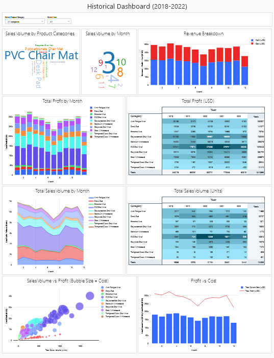
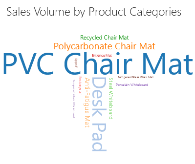
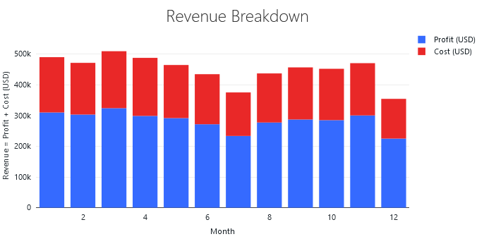
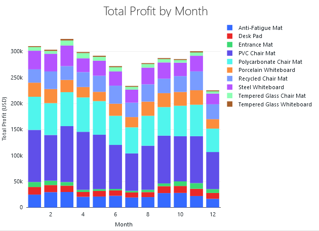
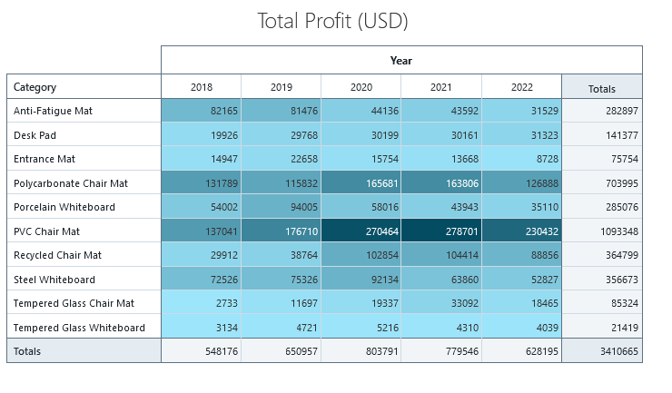
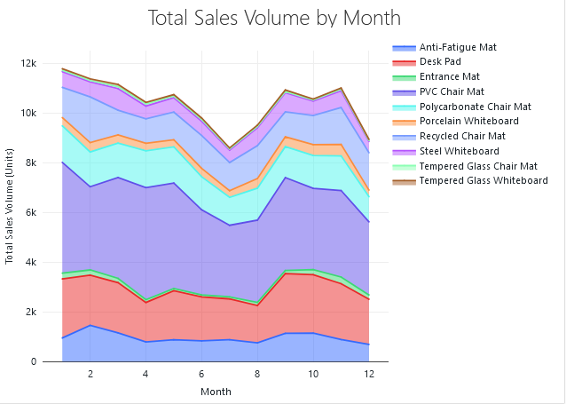
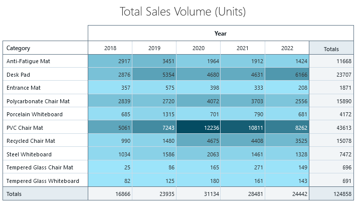
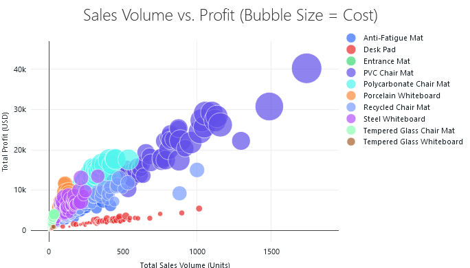
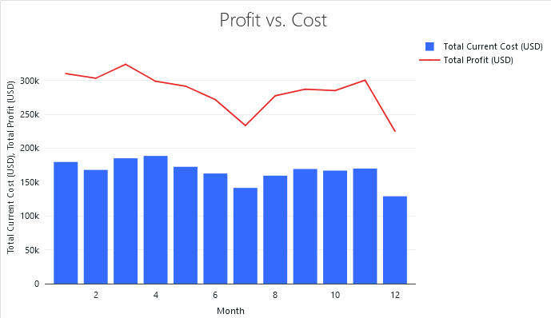

## __Group 6 Project 4: Sales Volume Forecasting__ 

__Project 4 Group Members:__

* Zachary Corbett
* Victor Donstov
* Sara Parveen
* Set Z

__Project Overview and Purpose of Data Model__

* For this project, we focused on improving the inventory planning process of an anonymous company.
* This anonymous company acts as a product distributor by purchasing office products from manufacturers, holding them and then reselling them to its business customers.
* By analyzing their office products' purchase, sales and product details data, we created a data model that makes predictions about the sales quantities for different product categories to be ordered in the future. 
* Knowing how much will be sold of each product category in the future can help determine how much of each product category should be kept in stock at any given time.
* Having a tool that assists in determining the ideal amount of inventory to have in stock at any given time is crucial to: 

  - meet customer demand and ensure customer satisfaction 
  - avoid having too much inventory which can lead to unnecessary storage and handling costs 
  - avoid stockouts which can result in sales loss 
  - maintain high profitability 

__Target Audience of Data Model__

The target audiences for this model are: 

  - the anonymous company whose data was analyzed 
  - all product sales planning, supply chain, and procurement professionals 

__Data Sources__

* The data used for this project comes in the form of CSV files obtained from the anonymous company. 
* The original data has been anonymized for the purposes of this project. 
* The CSVs have 5-years worth of data (2018 to 2022) for Purchase, Sales and Product Details.

__Data Hosting__ 

* Amazon AWS for hosting the CSV files 
* The model utilizes data retrieved from Pysark SQL 

__Database Creation__

* To help setup the database, an ERD schema was created as shown below:

 

* Amazon AWS feeds DBS databricks  

__Data Cleaning__      

* The ETL performed using PySpark by completing the following steps:
    1) Loading and merging DataFrames
    2) Selecting and filtering the columns to be used
    3) Converting the columns to the appropriate data type 
    4) Groupings the data to get yearly and monthly aggregates

%%%%%%%%%%%@@@@* The ETL process is documented in the Databricks notebook which can be viewed here:  

__Data Model Description__

We have used a time series model to make sales volumne predictions. The machine learning model is called SARIMAX (Seasonal Auto-Regressive Integrated Moving Average with eXogenous factors) which is an extension of the ARIMA class of models.

For predicting future sales volumes of each product category, we applied the SARIMAX model which takes into account the past experience (autoregressive model) and seasonality patterns. The model includes the following parameters: 

p - order of the autoregressive part 
d - degree of first differencing involved 
q - order of the moving average part 
P, D, Q - all previous characteristics with seasonal factors 
s - seasonal length in the data 

The following steps were completed to make predictions about overall sales volume using the SARMAX model. 

**NOTE: The following charts are based on data from all 10 product categories. Similar steps were performed for each individual product category and can be viewed by selecting the filter in the Forecasting notebook: @@@@@@@@@@@@@######

**1.	Identified the stationarity and difference of the time series:**

Based on the results of the Dickey-Fuller test, the p-value = 0.11034. As the p-value is greater than 0.05, we can suggest that our time series is non-stationary.  

Analyzing the ADF (Augmented Dickey-Fuller) chart, we can suggest the parameter p = 0 since coefficients of autocorrelation slowly decrease over time lags. In other words, autocorrelation is not significant.

**2.	Suggested the initial parameters:**

Since our series is not stationary, for further analysis, we need to make the time series stationary which was completed using the differencing method:  lag=1: y_dif(t+1)=y(t+1)- y(t) .

After applying the differencing method, the p-value of the Dickey-Fuller test equals 0.00000, so we can imply that the data is now stationary. We can suggest the other parameters: q=1 (as the first lag has a spike).

We can see little spikes at lag 12 and 24 on ACF (AutoCorrelation Function), so P can be equal to 1.
By decomposition of the time series, we can see the seasonal trend. We are using s =12 because we are using monthly sales volume data for predictions.

 

**3.	Generated the final parameters for the model:**

In order to find the best parameters for our model, we generated different series of parameters (p, d, q, P, D, Q). The parameters chosen were based on the lowest AIC (Akaike’s Information Criterion) scores.

**4.	Ran the SARIMAX model:**

The SARIMAX model generated monthly sales volume predictions for the next 12-month period. The predictions for the overall sales volume has a Mean Absolute Percentage Error of 12.72%.

We can imply that the model fits well based on the analysis of residuals.
   

__Data Model Results__

  * train and testing
  * Overall model performance is printed or displayed at the end of the script
   * The model demonstrates meaningful predictive power at least 75% classification accuracy or 0.80 R-squared.
   

__Visulizations and Dashboard Views__

  * Databricks was utilized to created both the visualizations and the dashboard for the historical data (2018-2022).
  * The dashboard shows visulaizations related to historical inventory sales volume, profits and costs.
  * __Here are screenshots of the dashboard:__ 
  
    **Overall view of dashboard: 
        

    **Word Cloud Chart #1 is based on Product Category Sales Volume 
        

    **Word Cloud Chart #2 is based on Monthly Sales Volume 
        

    **Revenue Breakdown (Stacked Bar graph) 
        
        
    **Total Profit by Month (Stacked Bar graph) 
        

    **Total Profit Table 
        

    **Total Sales Volumee by Month (Area graph) 
        

    **Total Sales Volume Table 
        

    **Sales Volumne vs Profit (Bubble Size = Cost) (Bubble Chart) 
        

    **Profit vs Cost Combo Chart (Bar graph and Line graph)  
        

__Limitations and Assumptions__

  1- There are 134 different product SKUs within the original dataset which can be classified into 10 unique product categories. For the purposes of our analysis and predictive model, we decided to focus on the 10 unique product categories to avoid scope creep.
      
  2- We have assumed that we have unlimited warehouse space to store the products in order to meet the sales demand.
      
  3- We have assumed we have unlimited resources and budget to order the ideal sales volume.
      
  4- We assumed there are no minimum order quantities.

__Challenges__
      
  1- We used Databricks for ETL which truncates the data to 10,000 rows. In order to fix this issue, we used groupings based on yearly and monthly data for each product category which reduced the number of rows to 592.
      
  2- The dashboards in Databricks do not have a default option of adding filters. We used Databricks Widgets to create filters in order to filter by year and by each product category which makes it a more dynamic dashboard.

__Conclusion__

